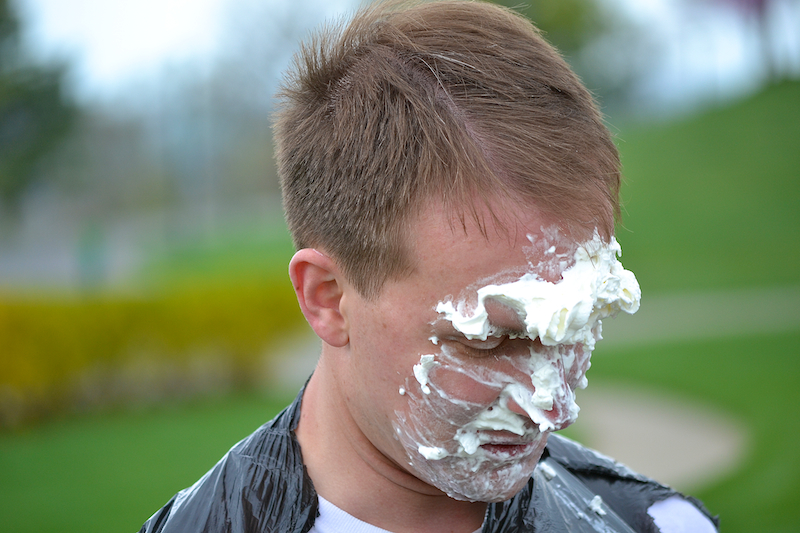

Established in 2012 at James Madison University in the Department of Chemistry and Biochemistry,the lab is focused on the determining the enzymatic mechanism(s) of acyl transfer and the structural mechanism of viral tethering. 

There are positions in the lab for undergraduate research assistants, please contact Dr. Berndsen if you are interested in more information.  

You can also see what is going on with the lab via [Twitter](https://twitter.com/kcat_km).

 
 
 

#### Information about Dr. Berndsen

**Education**

*Post-Doctoral work*: Johns Hopkins University School of Medicine and the Howard Hughes Medical Institute (2008 – 2012)

*Ph.D.*: Biomolecular Chemistry, University of Wisconsin-Madison School of Medicine, Madison, WI (2008)

*B.S.* Biochemistry, Roanoke College, Roanoke, VA (2003)

 
**Honors and Awards**
Ruth L. Kirschstein National Research Service Award

American Heart Association Pre-Doctoral Fellow

 

{ width=50% }

