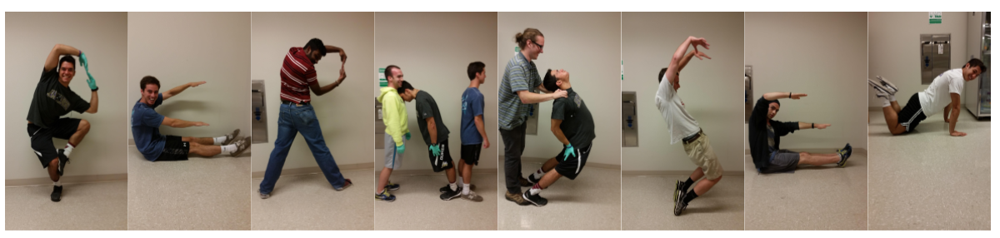

{ width=50% }

*Squiggles, Assays, and Plots* is an outlet for me to share with my students and the public fun insights in Biochemistry and data. I will add new posts or information as I have time and the interest. 

You can also see what is going on with me and the lab via [Twitter](https://twitter.com/kcat_km).

We also occasionally post new materials on [Github](https://github.com/CEBerndsen).

 { width=30% } <\center>

